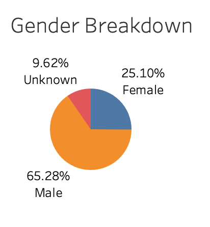

<<<<<<< HEAD
# NYCitibank_tableau

## Overview of analysis
The objective is to analyze bike trip data in order to convince potential investors that a bike-sharing program in Des Moines is a good business.

## Results
- The majority of the bike users are male with 65%

- The peak hours are in the morning around 8am and in the evening around 5pm

- Weekdays have higher peak usage while the weekends have more distributed usage throughout the day

- The same pattern holds true when broken out by gender

- Subscribers are the dominate user type

- The vast majority of trips are under 30 mins

- The trip time distributions are similar across genders

- All Charts are available at [link to dashboard](https://public.tableau.com/views/CitibikeAnalysis_16326822374030/BikeAnalysis?:language=en-US&publish=yes&:display_count=n&:origin=viz_share_link)

## Summary
- The majority of bike users are male subscribers.
- The peak hours during the weekdays are in the morning around 8am and the evening around 5pm. During the weekends the usage is distributed throughout the day.
- The majority if trips are 30mins or less.
- Recommended additional analysis:
  - vizualiation of trip distances
  - visuzliation of usage by age
=======
# NYCitibank_tableau
>>>>>>> 5c3ce30e319567009af94d1f10ab30b61ea8f578
